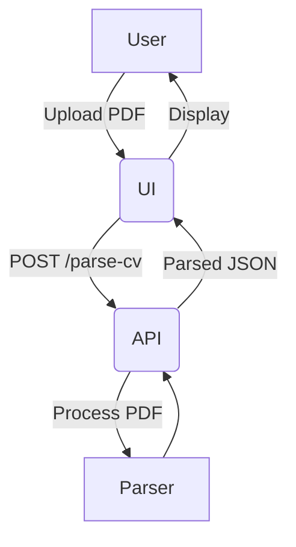

# Smart CV Interview Prep

## Table of Contents
- [Project Overview](#project-overview)
- [Features](#features)
- [Tech Stack](#tech-stack)
- [Architecture](#architecture)
- [Installation](#installation)
- [Running Locally](#running-locally)
- [API Endpoints](#api-endpoints)
- [Frontend Usage](#frontend-usage)
- [Testing](#testing)
- [Deployment](#deployment)
- [Contributing](#contributing)
- [License](#license)
- [Contact](#contact)

---

## Project Overview

**Smart CV Interview Prep** is a full-stack web application designed to assist users in preparing for technical interviews by analyzing and parsing uploaded CVs (PDF format). The system extracts key CV sections (Projects, Experience, Skills, etc.) using a backend parsing service and provides a user-friendly interface to review and prepare for interviews effectively.

This project integrates a React frontend with a FastAPI backend and utilizes advanced file parsing techniques for PDF documents. It supports privacy-preserving and efficient CV processing workflows, aiming to streamline the interview preparation journey.

---

## Features

- Upload PDF CVs and extract structured CV sections.
- Display parsed CV sections interactively.
- Real-time error handling and validation.
- Support for common CV sections: Projects, Experience, Skills, Extracurricular.
- Responsive, modern UI using React and Tailwind CSS.
- Backend API using FastAPI with async processing.
- Docker-ready and cloud deployment support.

---

## Tech Stack

| Layer       | Technology                       |
|-------------|--------------------------------|
| Frontend    | React, Tailwind CSS, Vite       |
| Backend     | Python, FastAPI, Uvicorn        |
| Parsing     | PDFMiner / PyMuPDF / Custom Logic|
| Deployment  | Heroku / Docker / Local          |

---

## Architecture

# Installation

### Prerequisites

- **Node.js** (v16+ recommended)
- **Python** 3.10+
- **Git**
- **pip** for Python packages
- (Optional) **Docker**

---

### Clone Repository

Bash

`git clone https://github.com/Atishyy27/lastprep.git
cd lastprep`

---

## Backend Setup

### 1. Create and activate a Python virtual environment:

Bash

`cd backend
python -m venv venv

# On Windows
.\venv\Scripts\activate

# On Linux/Mac
source venv/bin/activate`

### 2. Install dependencies:

Bash

`pip install -r requirements.txt`

### 3. Run the backend server:

Bash

`uvicorn backend.main:app --host 0.0.0.0 --port 5000 --reload`

---

## Frontend Setup

### 1. Move to the frontend directory:

Bash

`cd ../frontend`

### 2. Install dependencies:

Bash

`npm install`

### 3. Start the frontend dev server:

Bash

`npm run dev`

The app will be available at `http://localhost:5173` by default.

---

## API Endpoints

| Endpoint | Method | Description |
| --- | --- | --- |
| `/parse-cv` | `POST` | Upload PDF and parse CV data |
| `/health` | `GET` | Check backend health status |

Export to Sheets

---

## Frontend Usage

1. Navigate to the **Upload** page.
2. Select a PDF CV file (only PDFs are allowed).
3. Click "**Upload & Parse CV**".
4. View extracted CV sections with detailed breakdowns.
5. Use the UI components to review and prepare for interviews.

---

## Testing

### Backend unit tests:

Tests are located in `backend/tests/`.

Bash

`cd backend
pytest`

### Frontend tests:

Tests (if any) can be run with:

Bash

`cd frontend
npm test`

---

## Deployment

### Heroku

1. Ensure a `Procfile` exists with the following content:Bash
    
    `web: uvicorn backend.main:app --host=0.0.0.0 --port=${PORT:-5000}`
    
2. Commit and push changes to the Heroku remote.
3. Set buildpacks for Python and Node.js in the Heroku dashboard.
4. Deploy and monitor logs:Bash
    
    `heroku logs --tail`
    

### Docker (Optional)

- Build **docker images** for the backend and frontend.
- Use **docker-compose** to run the multi-container app.

---

## Contributing

Contributions are welcome! Please fork the repo and open pull requests for new features, bug fixes, or improvements. Follow the existing code style and provide tests where applicable.

---

## License

This project is licensed under the **MIT License** - see the `LICENSE` file for details.
